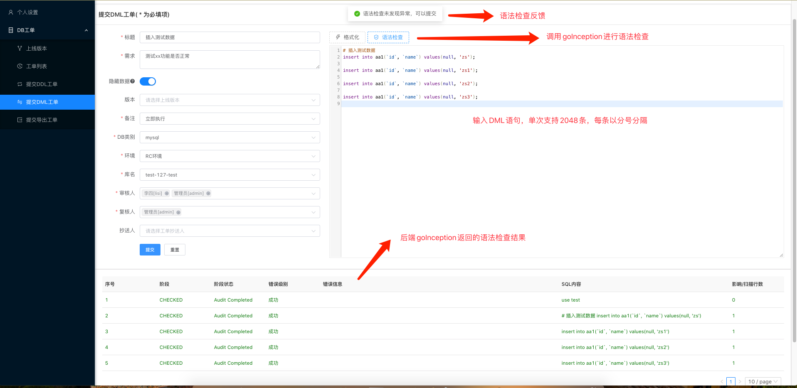
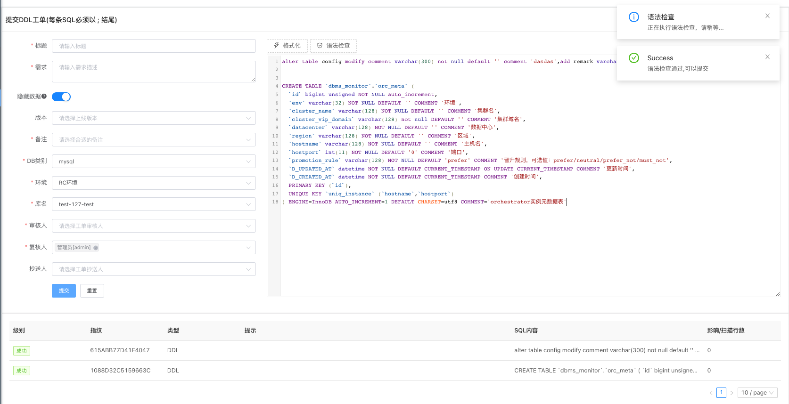
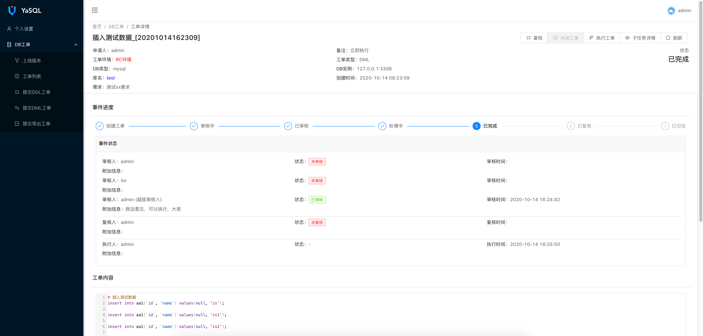

# YaSQL简介

 

YaSQL是一款MySQL/TiDB的数据库审核执行平台，旨在降低DBA的运维成本，规范上线SQL执行流程

## 文档
[使用文档](https://github.com/lazzyfu/YaSQL/tree/master/docs)

## 语法审核工具
[gAudit](https://github.com/lazzyfu/gAudit)

## 功能简介
* 自定义工单环境
  * 可根据业务场景，自定义工单的环境，比如：测试环境、预发布环境、生产环境等等
* 支持的工单类型
  * DML工单
  * DDL工单
  * 导出工单（支持SELECT语句导出为CSV、XLSX格式）
* 支持的DB类型
  * MySQL（>=5.6， Percona Server & 官方MySQL）
  * TiDB
  * Mariadb（暂不支持Mariadb生成备份语句）
  * ClickHouse（暂不支持生成备份语句）
* 语法规则
  * 集成[gAudit](https://github.com/lazzyfu/gAudit)
  * 前端支持语法高亮、格式化、注释、补全
* 支持MySQL/TIDB/ClickHouse/Redis查询（类似DMS查询功能）
  * 支持库表级别授权
  * 支持基于用户/组授权
  * 支持查询审计功能（自动记录用户执行的SQL）
* 消息推送功能
  * 邮件
  * 钉钉
  * 企业微信
* 其他功能
  * 支持钩子功能，工单可以在各个环境内自由hook
  * MySQL DDL ALTER语句自动使用gh-ost改表
  * DML语句执行、支持获取锁定超时、事务封装、自动开启严格模式执行
  * 单个工单最大支持2048条SQL语句
  * MySQL DML语句支持自动生成回滚SQL（真实影响行数小于10W行）
  * 支持执行前台实时展示（基于websocket实现）
  * 支持自定义用户角色、可为每个角色绑定不同的工单权限
  * 支持集成LDAP（若支持LDAP密码修改，请自行实现相关接口）
  * 支持后台创建用户、密码修改（非LDAP模式）、修改头像

## 系统架构

## 预览

## 二次开发
欢迎大家基于自己公司的业务场景进行二次开发\^_\^

#### 个人博客
https://lazzyfu.github.io/