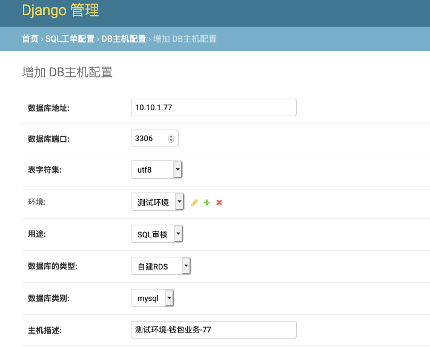

# 用途
连接目标环境数据库，执行审核、执行、备份、查询等操作

#### 配置通用的连接数据库账号
vim yasql/config.py
```python
# 连接目标需要审计或执行工单的数据库的用户
# 每个连接的目标数据库都需要创建，用于goInception、工单执行、备份、查询
# create user 'yasql_rw'@'%' identified by '1234.com'
# grant all on *.* to 'yasql_rw'@'%';
# 用户名和密码请进行自行修改，不要使用默认的
REOMOTE_USER = {
    'user': 'yasql_rw',
    'password': '1234.com'   # 更改为你自己的复杂的密码
}
```

#### 在所有需要审核操作的目标数据库创建账号
```sql
create user 'yasql_rw'@'%' identified by '1234.com'
grant all on *.* to 'yasql_rw'@'%';
```
> 权限尽可能的大，我这里设置了all

> 该账号会涉及到备份、改表、goInception审核等操作

#### 后台添加目标数据库

后台admin › 首页 › SQL工单配置 › DB主机配置 › 增加 DB主机配置 

数据库用途选项：
* SQL审核
  用于DDL、DML工单的提交，请选择SQL审核。SQL审核需要配置为写库】
* SQL查询
  用于提交导出工单，导出工单走只读库（集群）。如果就一个实例，可以指定为写库

如下图(加载不动，请翻墙)：


#### 查看
配置完目标数据库后，系统没10分钟会触发一次元数据信息采集

> 你也可以更改任务的时间间隔

> 你也可以手动触发，勾选任务-> 动作【Run selected tasks】


定时任务：admin后台 › 首页 › Periodic Tasks › Periodic tasks › 同步数据库元数据信息到本地表: every 10 minutes 

采集到的信息查看：admin后台 › 首页 › SQL工单配置 › DB库 

任务日志位置：
* /data/www/yasql/yasql/logs/yasql-celery-dbtask.log   # 任务状态
* /data/www/yasql/yasql/logs/celery.log                # 代码里面的logger输出

