# 截图预览
仅展示部分截图

* 仪表盘

* 提交页面（展示DML，DDL、EXPORT类似）

* 工单列表页面
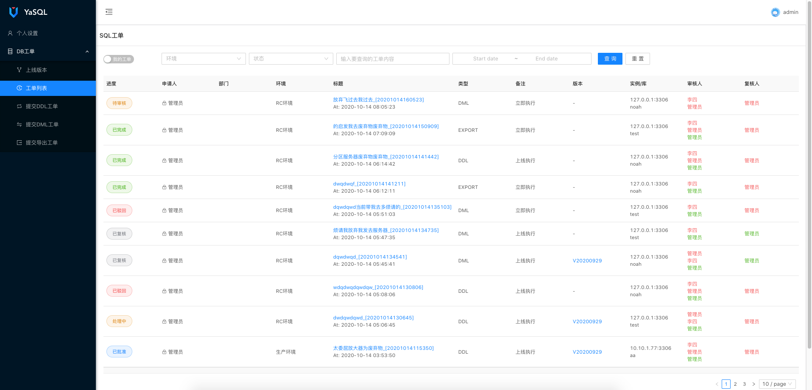

* 工单详情页面

* 工单执行页面
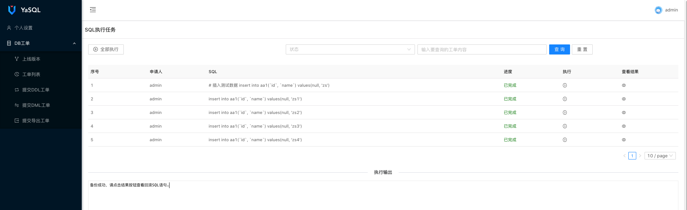

* 工单执行结果页面（包含回滚SQL）
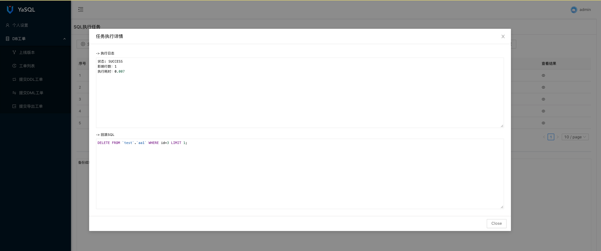

* 工单执行详情
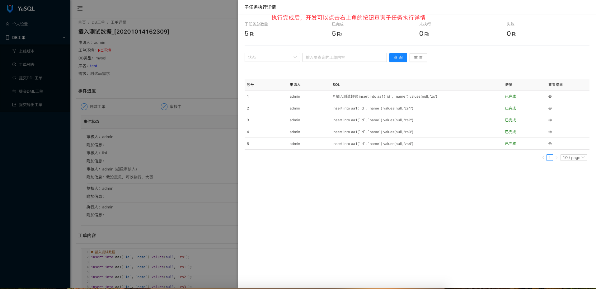

* SQL查询
  * 查询界面
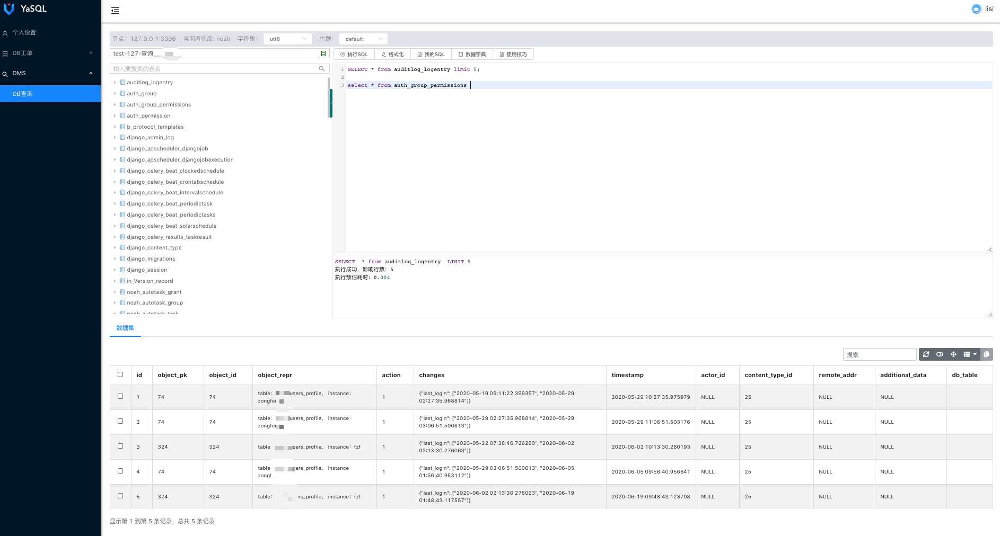

  * 右击表名查看
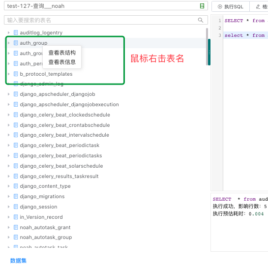

  * 查看表结构
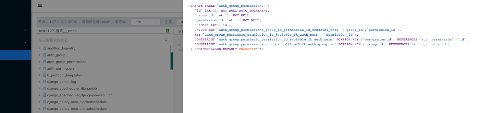

  * 查看表基本信息
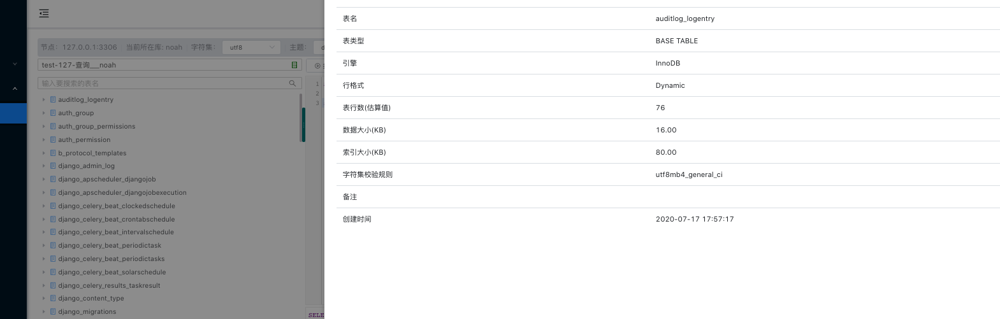

  * 查看库数据字典
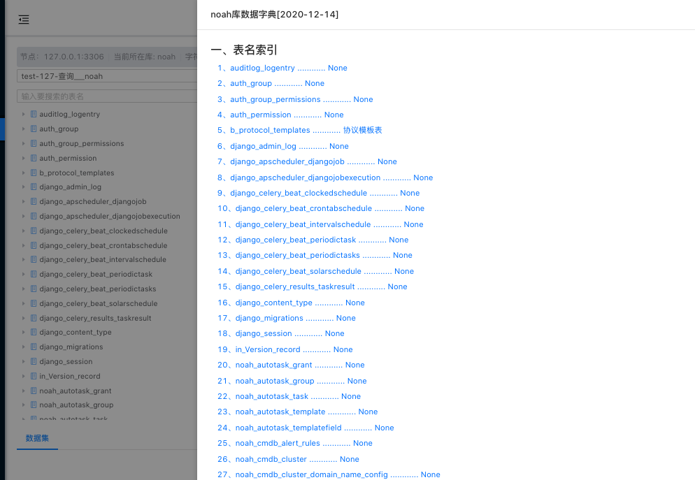

  * 查看库数据字典

  * 查看我的SQL
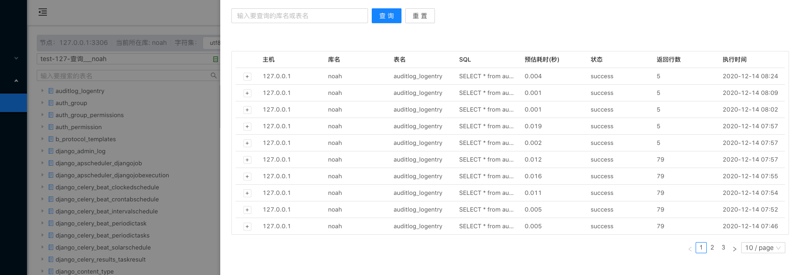

* 工单消息（仅列出企业微信，钉钉和邮件一样）
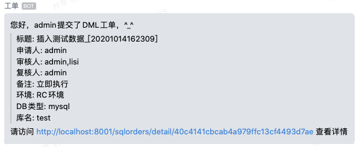
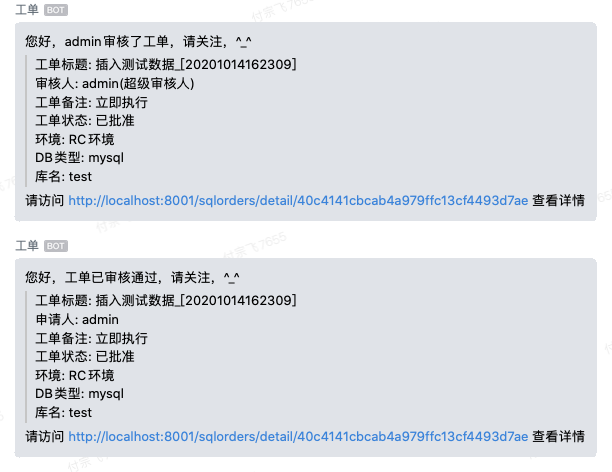
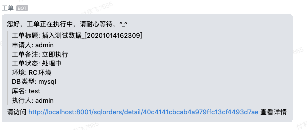
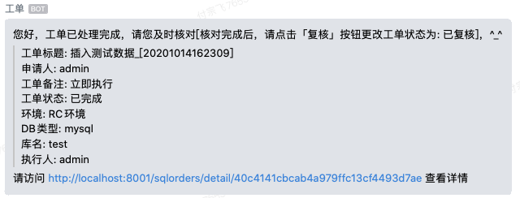